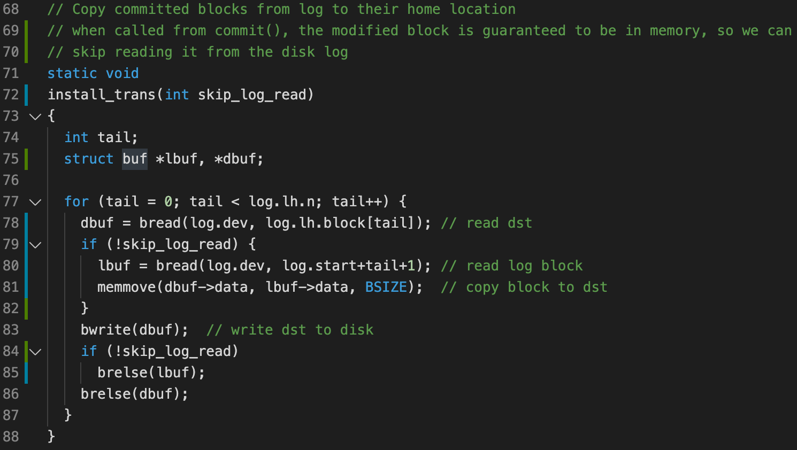

# Homework 11: xv6 log

## Creating a problem

First, replace `commit()` in `log.c` with this code, to force a crash:

```C
#include "mmu.h"
#include "proc.h"
void
commit(void)
{
  int pid = myproc()->pid;
  if (log.lh.n > 0) {
    write_log();
    write_head();
    if(pid > 1)            // AAA
      log.lh.block[0] = 0; // BBB
    install_trans();
    if(pid > 1)            // AAA
      panic("commit mimicking crash"); // CCC
    log.lh.n = 0; 
    write_head();
  }
}
```

When creating a new file, the log was successfully written to disk, but the block containing the updated inode wasn't.

When restarted without recovering from the logs, the FS is in inconsistent state: the root directory points to a inode which wasn't allocated.

## Solving the problem

When restarted with recovering from the logs, the FS gets fixed. 

This is because all logs are successfully written to the disk.

## Streamlining commit

* *Why it would be a mistake for the buffer cache to evict block 33 from the buffer cache before the* 

    *commit?*

    If evicted, the only fresh copy of block 33 is in the log (block 3). Reads to block 33 will get the stale data.

Rewrite `install_trans()` such that it doesn't go to the disk when called from `commit()`:




