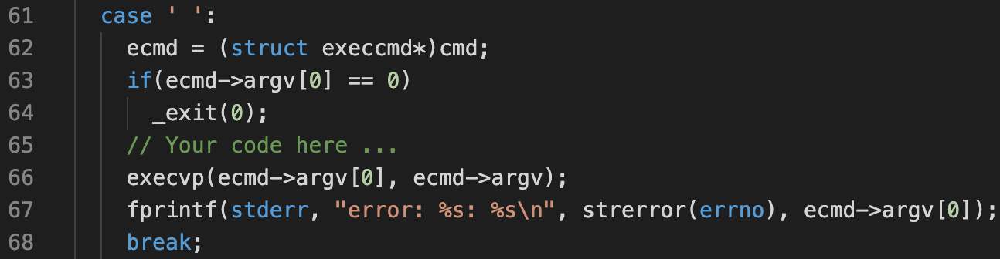
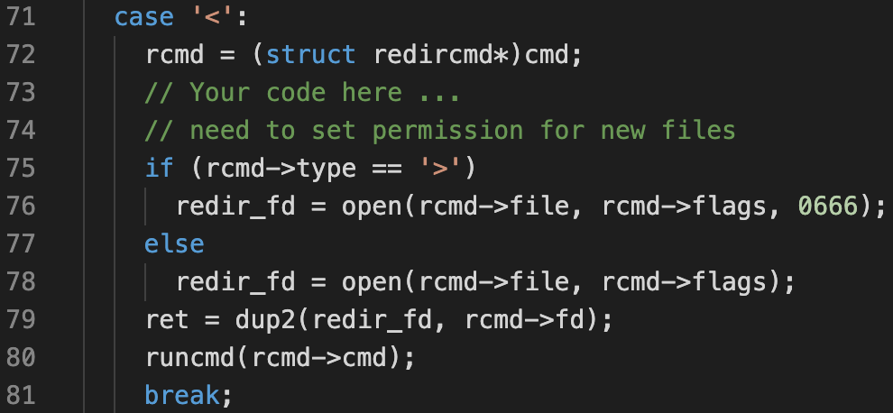
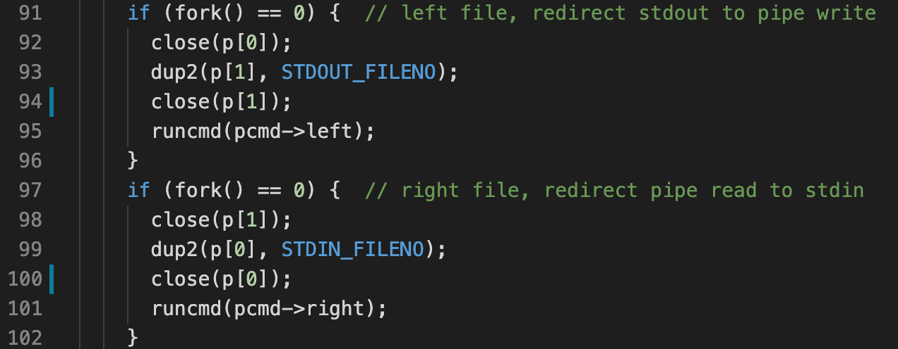

# Homework 2: shell

#### 1. Executing simple command

Invoke corresponding binary. Use `execvp()` to automatically search the binary under `$PATH`.

Ideally, the `execvp()` call will not return.

#### 2. I/O redirection

Setup I/O redirection with `dup2()`, then, recursively call `runcmd()`.

Note that there are two UNIX design decisions involved here:

* `fork()` and `exec()` are implemented as separate syscalls
* `exec()` does not overwrite file descriptors

This means the parent process can first call `fork()`, setup redirections, and then load the child process with `exec()`. The child process doesn't have to under its I/O redirections. 

#### 3. Pipes

Use `pipe()` to create a uni-directional pipe, and setup redirections:

Note that after calling `dup2()`, it's necessary for *both* processes to close *both* ends of the pipe (line #94, #100). This makes sure after the sender leaves, the receivers can read an EOF, instead of hanging indefinitely.