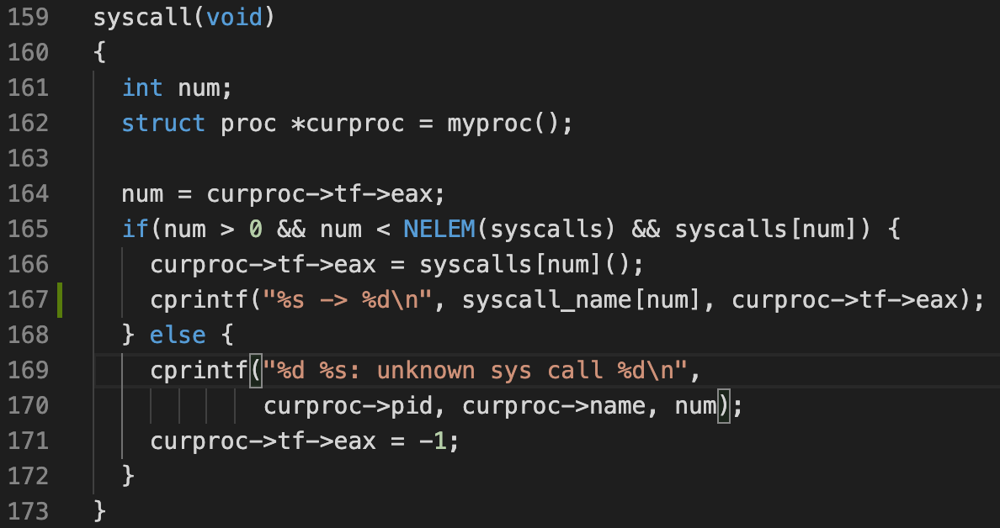
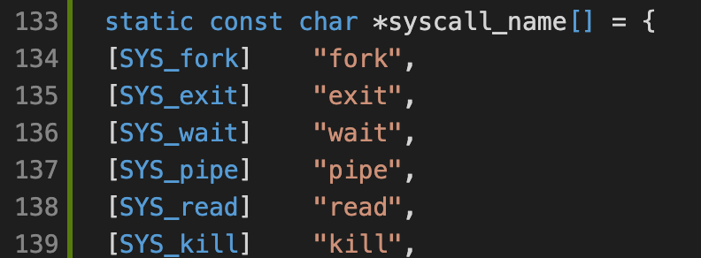
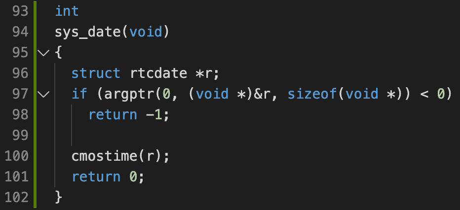
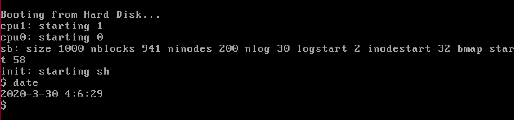

# Homework 3: xv6 system calls

## Part 1:  System call tracing

Modify the xv6 kernel to print out a line for each system call invocation. Print the name of the system call and the return value:

* Need to construct an array for syscall name lookup. This syntax means that element at index `SYS_fork` has value `"fork"`:

## Part 2: Date system call

Add a new syscall to print the date and time:

where `argptr(int n, char **pp, int size)` gets the n-th syscall argument value.

Typing `date` on the command line prints the current date:

