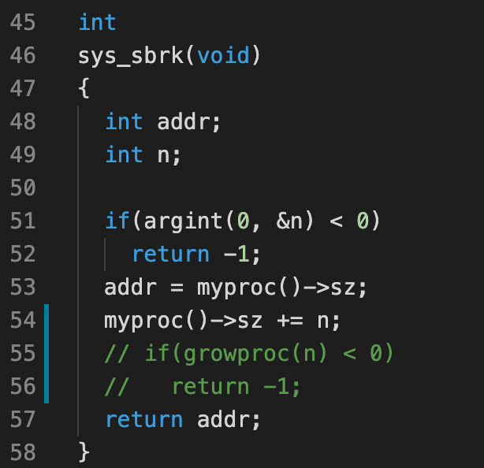
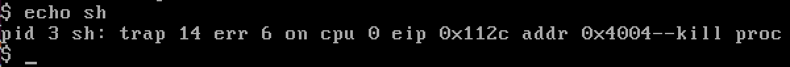
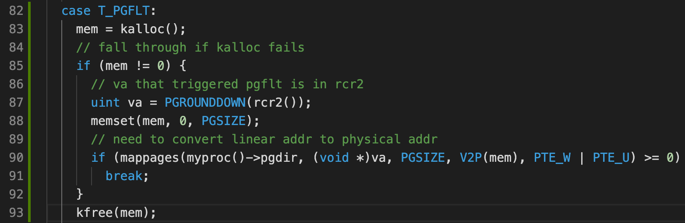

# Homework 4: xv6 lazy page allocation

## Part 1: Eliminate allocation from sbrk()

Modify the `sys_sbrk()` system call, such that it doesn't allocate new pages immediately. This causes a page fault on next access to this address.

At this time, typing `echo sh` on the command line will cause an error:

This is because `trap.c` does not know how to handle trap 14 (`T_PGFLT`). Address `0x112c` is the virtual address that caused the page fault.

## Part 2: Lazy allocation

Modify the trap handler in `trap.c` to support handling `T_PGFLT`:

Note that you need to set permission correctly. For example, if `PTE_W` permission is not given, the next access after this page fault will also be a page fault, causing `mappages()` to `panic("remap");`.