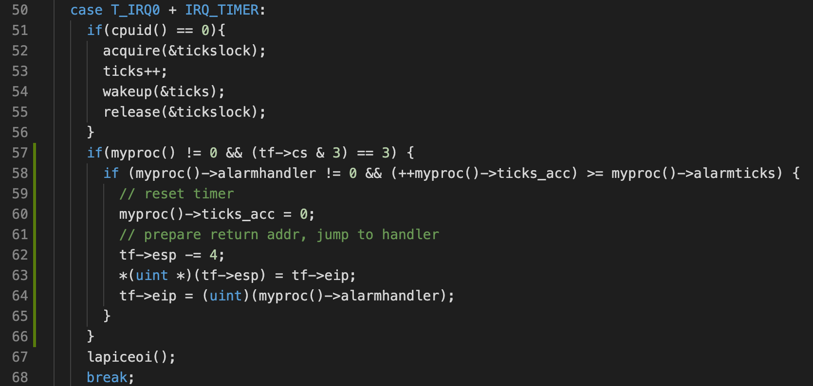
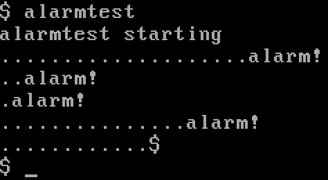

# Homework 5: xv6 CPU alarm

Implement system call `alarm(interval, handler)`:

* If an application calls `alarm(n, fn)`, then after every `n` "ticks" of CPU time that the program consumes, the kernel will cause application function `fn` to be called. 
* When `fn` returns, the application will resume where it left off.

Every once in a while, the clock forces an interrupt, which is handled in `trap()` by `case T_IRQ0 + IRQ_TIMER`. Therefore we can maintain a counter in each `struct proc`, and check the count in the handler:

Note that we cannot call the `alarmhandler()` directly from the trap handler, because it's supposed to be invoked from user space. Instead, we can:

* Push `%eip` to stack. When `alarmhandler()` returns, program returns to where it left off.
* Set `%eip` to `alarmhandler()`. When trap returns, the user space program starts executing `alarmhandler()`.

Compile and run, typing `alarmtest` on the JOS command line produce output like this:

