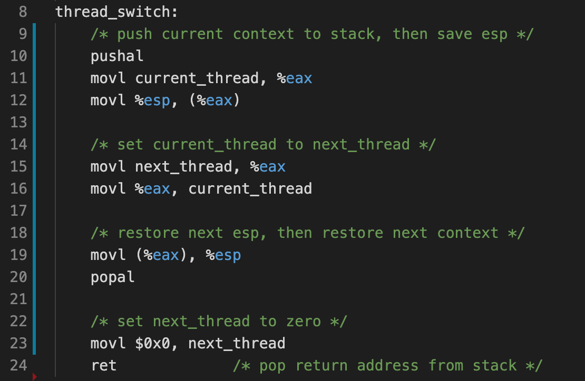

# Homework 8: User-level threads

In this assignment you will complete a simple user-level thread package by implementing the code to perform context switching between threads.

Your job is to complete `thread_switch.S`, which switches between two user-level threads. Simply save/restore context and `%esp`:

