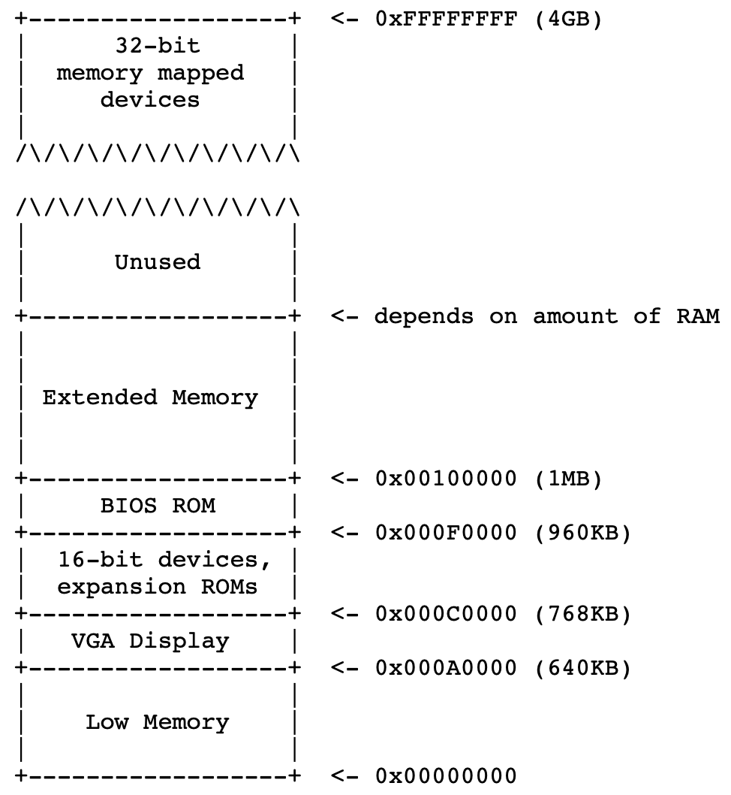
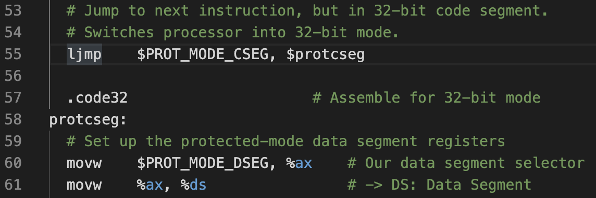
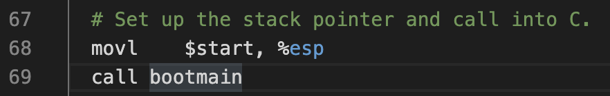
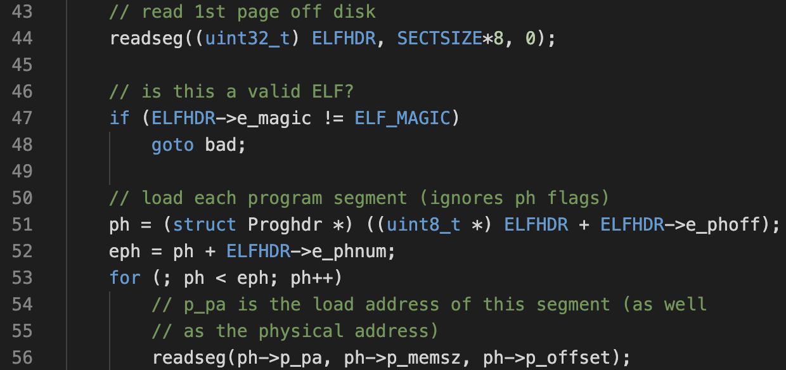
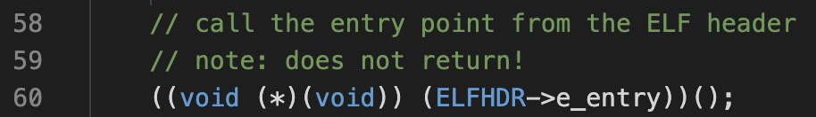
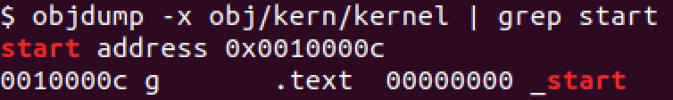
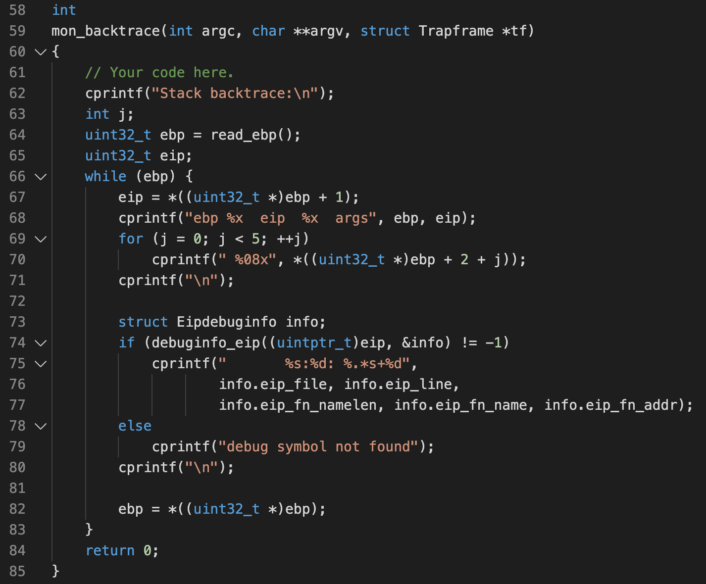

# Lab1: Booting a PC

This lab has 3 sections:

1. Getting familiar with x86 assembly language, the QEMU x86 emulator, and the PC's power-on bootstrap procedure.
2. Examine the bootloader for the 6.828 kernel (`boot/`).
3. Delves into the initial template for the 6.828 kernel, named JOS.

## Part 1: PC Boostrap

#### x86 assembly

This course follows the AT&T x86 syntax. It is semantically equivalent to the Intel x86 syntax:

* [Brennan's Guide to Inline Assembly](http://www.delorie.com/djgpp/doc/brennan/brennan_att_inline_djgpp.html)
* [Intel 80386 reference manual](https://pdos.csail.mit.edu/6.828/2018/readings/i386/toc.htm)

#### Simulating the x86

This course uses a custom-built QEMU with several useful debugging changes, which can be installed following the directions on the [tools page](https://pdos.csail.mit.edu/6.828/2018/tools.html). 

QEMU can act as a **remote debugging target** for GDB, so that we can step through the early boot process.

```bash
# run qemu with kernel.img [without virtual VGA] [stops before executing first instruction to wait for GDB]
$ make qemu[-nox][-gdb]
```

#### PC's Physical Address Space

A PC's physical address is hard-wired to have the following layout:



\The first PCs were based on the 16-bit Intel 8088 processor, which is capable of addressing only 1MB of physical memory (therefore [0x000A0000, 0x000FFFFF]). 

* **Low Memory:** This 640KB region were the only area that an early PC could use.
* **"I/O hole"**: This layout is preserved for compatibility. The BIOS occupies the top 64KB of this region.
* **Extended memory**: Used by more modern PCs. Some space at the very top of the 32-bit address space is now commonly reserved by the BIOS for use by 32-bit PCI devices. This means to support more than 4GB of physical memory, BIOS must arrange to leave a *second* hole.

#### The ROM BIOS

BIOS is "hard-wired" to the physical address range [0x000F0000, 0x000FFFFF], and always gets control of the machine first: On processor reset, the processor enters real mode and sets CS to 0xF000 and the IP to 0xFFF0, so that execution begins at that (CS:IP) segment address (0xFFFF0).

The BIOS initializes the PCI bus and all the important devices the BIOS knows about, and then searches for a **bootable device** such as a floppy, hard drive, or CD-ROM.

Floppy and hard disks for PCs are divided into 512 byte regions called *sectors*. If the disk is bootable, the first sector is called the *boot sector*. When the BIOS finds a bootable floppy or hard disk, it loads the 512-byte boot sector into memory at physical addresses 0x7c00 through 0x7dff, and then uses a `jmp` instruction to set the CS:IP to `0000:7c00`, passing control to the boot loader.

## Part 2: The Boot Loader

The files `boot/boot.S` and `boot/main.c` contain the xv6 boot loader. The file `obj/boot/boot.asm` is a disassembly after compiling the boot loader.

We can see that the bootloader performs several additional tasks:

1. Switch from 16-bit real mode to 32-bit protected mode



2. Initialize a stack so that the C code can run



3. Load the kernel binary ELF from the first disk sector. Note that it uses a magic number to check whether the ELF is valid. 



4. Pass control to OS kernel by calling its entry point (the `_start` symbol). 



- To find out the kernel ELF's entry point (`_start`), you can dump symbols of the ELF binary by `objdump -x <binary>`, or `objdump -f <binary>`:



## Part 3: The Kernel

#### Use virtual memory to work around position dependence

OS kernels often like to be linked and run at very high *virtual address*, such as 0xf0100000, in order to leave the lower part of the processor's virtual address space for user programs to use. However, it doesn't necessarily have to be loaded in the same way. 

This is enabled by the separation of ELF's **link address** and **load address** -- the OS thinks it is being loaded to link address, but it's actually loaded to load address. To bootstrap, we use a hand-written, statically-initialized page directory and page table in `kern/entrypgdir.c`.

#### Formatted Printing to the Console

See `kern/printf.c`, `lib/printfmt.c` and `kern/console.c`. 

#### The Stack

In this exercise, we write a new kernel monitor function that 1) prints a *backtrace* of the stack, and 2) along with debug information including the function name, source file name, and line number corresponding to that `eip`.

* The x86 stack pointer `%esp` points to the lowest location on the stack that is currently in use. The base pointer `%ebp` normally saves the previous function's base pointer by pushing it onto the stack, and then copies the current `%esp` value into `%ebp` for the duration of the function. So we can follow the `%ebp` to recursively trace back to the bottom of the stack.
* The function `debuginfo_eip()` searches for debug information in the symtol table (`__STAB_*`).

