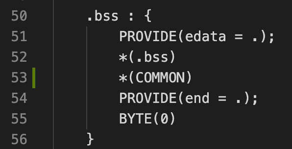
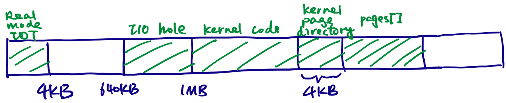
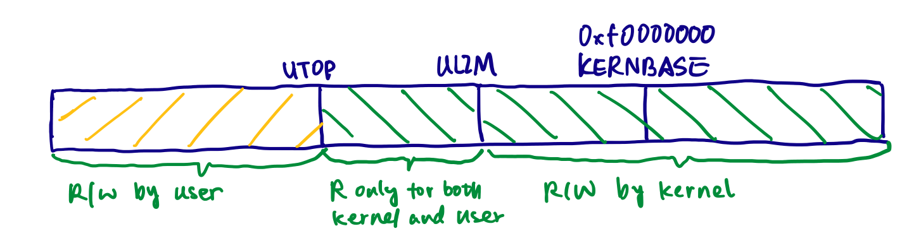

# Lab2: Memory Management

This lab has 3 sections:

1. Physical memory management: write a physical memory allocator for the kernel.
2. Virtual memory management: map the virtual addresses to physical addresses. The x86 hardware's memory management unit (MMU) walks the page tables, but the software is responsible for constructing the page tables.
3. Initialize kernel virtual memory space.

*In the original `kernel.ld`, the `.bss` section does not have the `COMMON` section, causing the `end` symbol being linked to an address lower than uninitialized global variables, which might break the system. So I added my own:*



## Part 1: Physical Page Management

The operating system must keep track of which parts of physical RAM are free and which are currently in use. JOS manages the PC's physical memory with *page granularity* so that it can use the MMU to map and protect each piece of allocated memory.

#### What's the interface?

The interface is invoked by the virtual memory allocator:

```C
struct PageInfo *page_alloc(int alloc_flags);
void page_free(struct PageInfo *pp);
```

#### Which physical pages to map?

Some pages are already taken, so the allocator manages the remaining pages (in white):



#### How does it work?

* The allocator maintains an `struct PageInfo* pages[]` array to keep track of each physical page. 
    * This struct contains a reference count. So when multiple virtual pages matches to the same physical page, it knows when to free.
    * Note that unlike `malloc()`, this array is not embedded in the free blocks themselves.
* Track vacant physical pages in a free list.

## Part 2: Virtual Memory Management

JOS uses a two-level page table, with each page being 4 KB.

#### What's the interface?

```C
static void boot_map_region(pde_t *pgdir, uintptr_t va, size_t size, physaddr_t pa, int perm);
int page_insert(pde_t *pgdir, struct PageInfo *pp, void *va, int perm);
struct PageInfo *page_lookup(pde_t *pgdir, void *va, pte_t **pte_store);
void page_remove(pde_t *pgdir, void *va);
```

#### Kernal cannot bypass page translation

In x86, there are 2 layers of address translation, which the kernel don't have direct control:

* *Segment translation*: once entering 32-bit protected mode from 16-bit real mode, the kernel cannot bypass segment translation
* *Page translation*: Once enabled, the kernel cannot bypass page translation. To bypass this restriction, we perform a linear mapping from back to the physical memory space. 
    * **%cr0**: turn on paging (paging is optional)
    * **%cr3**: entrypgdir

Note that in JOS, we map vaddr `[0xF0000000, 0xFFFFFFFF]` to paddr `[0x00000000, 0x0FFFFFFF]`, meaning that:

* The kernel binary references vaddr.
* The hardware, which walks the page table, references paddr. So, when constructing the page tables, need to explicitly convert vaddr to paddr.


## Part 3: Kernel Address Space

#### Initialize the Kernel Address Space

The virtual memory layout is in `inc/memlayout.h`. A brief version is:

