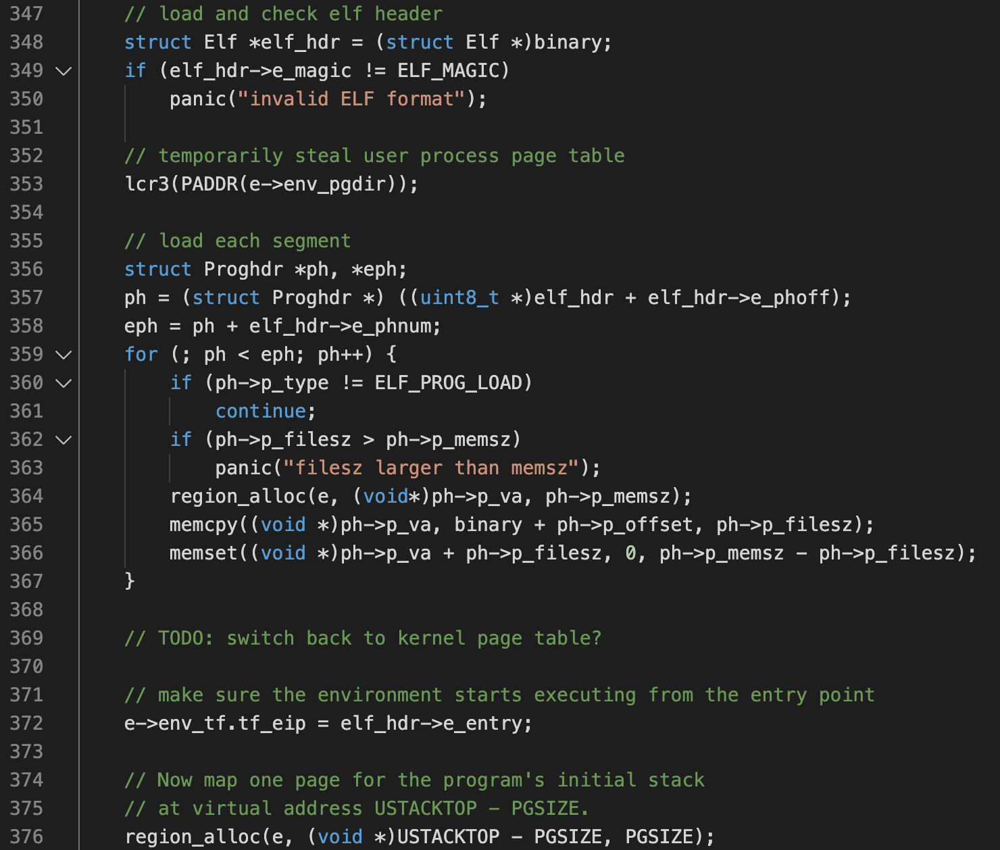
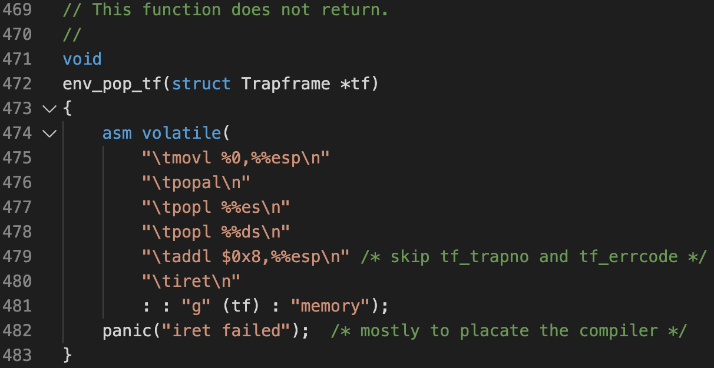
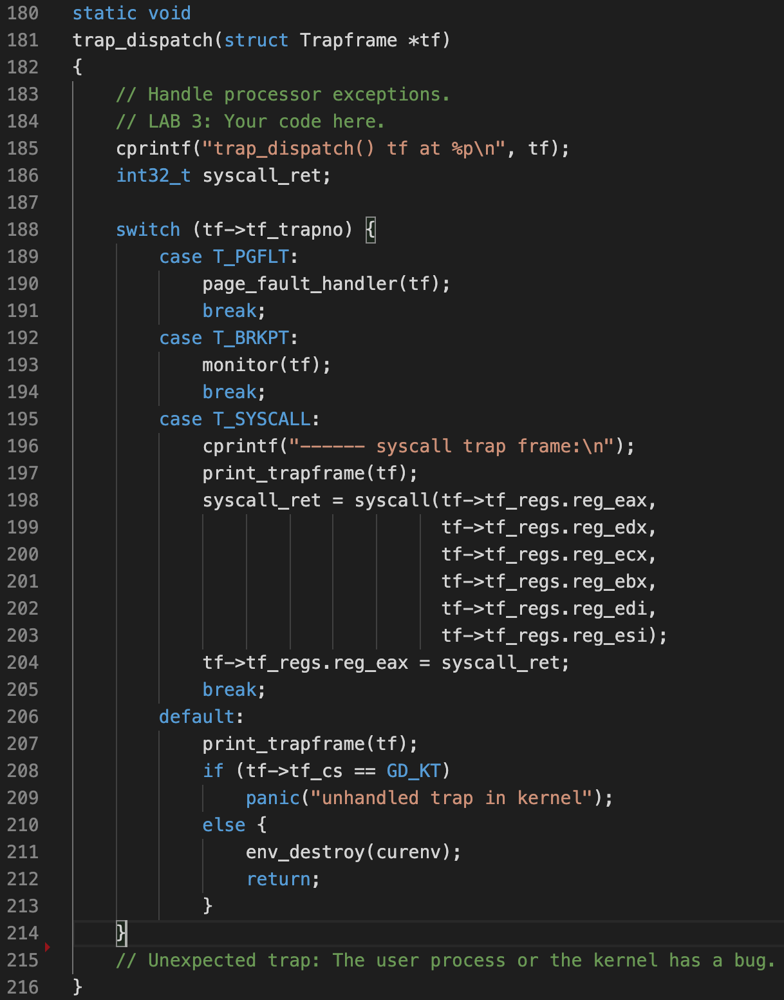
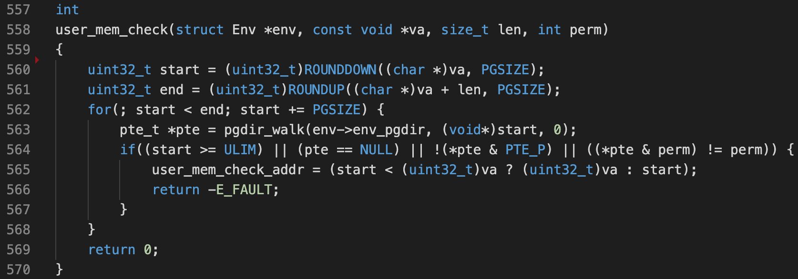

# Lab3: User environments

This lab has 2 sections:

1. Implement the basic kernel facilities required to get a protected user-mode environment (i.e., "process") running.
2. Make the JOS kernel capable of handling any system calls the user environment makes and handling any other exceptions it causes.

## Part A: User Environments and Exception Handling

The kernel uses the `Env` data structure (defined in `inc/env.h`) to keep track of each user environment. The `envs[]` array is initialized with `mem_init()` in `pmap.c`:

```C
struct Env *envs = NULL;           // All environments
struct Env *curenv = NULL;         // The current env
static struct Env *env_free_list;  // Free environment list
```

where each `struct Env` maintains states for a particular process:

```C
struct Env {
    struct Trapframe env_tf;    // Saved registers
    struct Env *env_link;       // Next free Env
    envid_t env_id;             // Unique environment identifier
    envid_t env_parent_id;      // env_id of this env's parent
    enum EnvType env_type;      // Indicates special system environments
    unsigned env_status;        // Status of the environment
    uint32_t env_runs;          // Number of times environment has run
    pde_t *env_pgdir;           // Kernel virtual address of page dir
};
```

Now, to enable JOS to run user programs, the following things need to be done:

1. Initialize the kernel data sturctures for user environments -- `env_init()`

2. Set up user page table -- `env_setup_vm()`

3. Load a ELF binary into user space -- `load_icode()`

    * Set the environment's *trapframe* by setting its `$eip` to the program entry point

        

    * Note that ELF *program headers* and *section headers* are different: a *program* may contain multiple *sections*

4. Run the loaded program. This is performed by:

    * Call `iret`, just like when returning from a normal interrupt/exception. This works because we have manually setup a trapframe, and set its `$eip` to ELF `_start`

        

## Part B:  Page Faults, Breakpoints Exceptions, and System Calls

1. First, setup the *interrupt descriptor table* (IDT)
    * In `trapentry.S`, define each handler with `TRAPHANDLER()` or `TRAPHANDLER_NOEC()`
    * Note that in JOS, these handlers each prepare a different trapframe. Then, they call the same `trap()` function with this trapframe being the argument. Then, `trap()` calls `trap_dispatch()`.
    * System calls have different privilege levels -- some can be called only from the kernel
    * In `trap.c`, add handlers to IDT with `SETGATE()`

2. Implement `trap_dispatch()` to dispatch interrupt handling. Note that system calls are just a different type of interrupt, with trap number of `0x30`:

​	

3. Most system call interfaces let user programs pass pointers to the kernel. The kernel then dereferences these pointers while carrying out the system call, which can be danagerous. To fix this, we need to perform sanity checks on user-passed addresses:

​	

