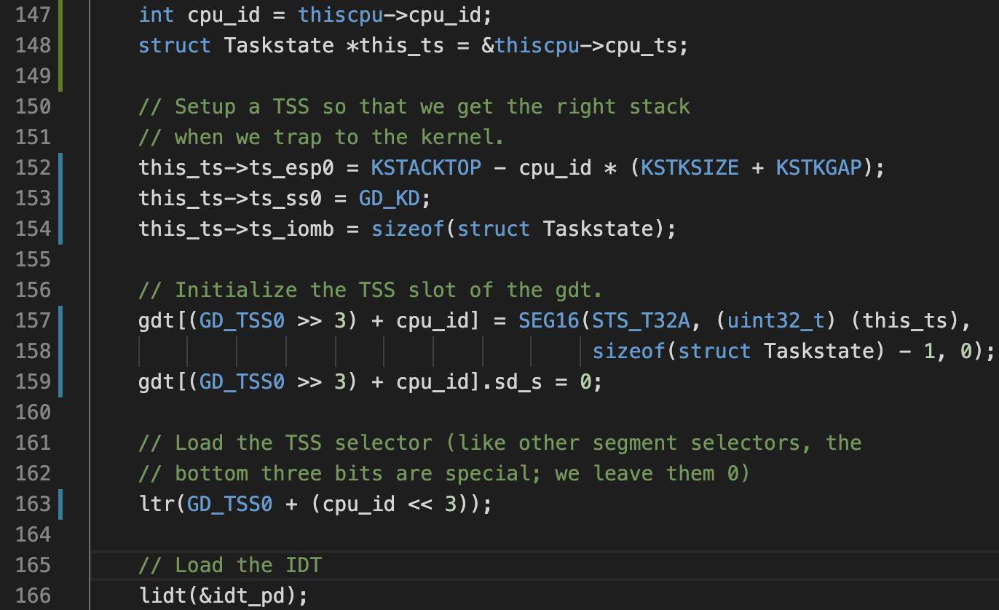
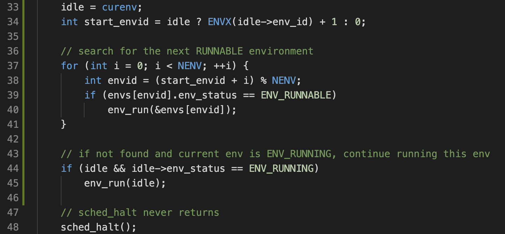
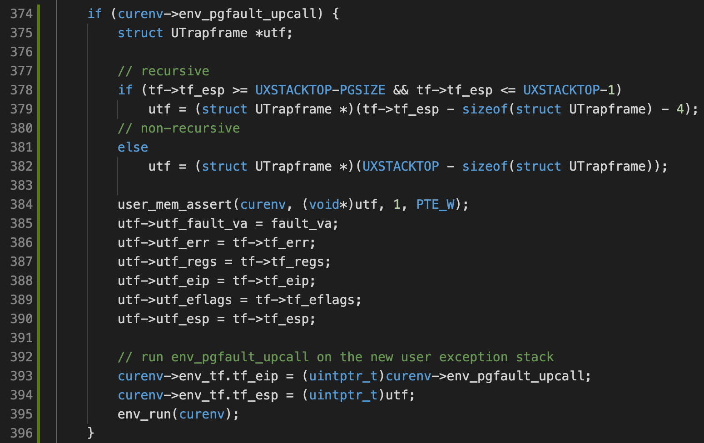
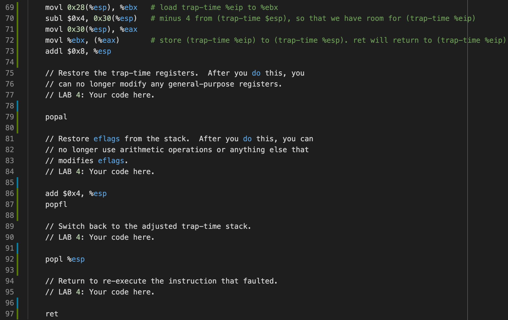
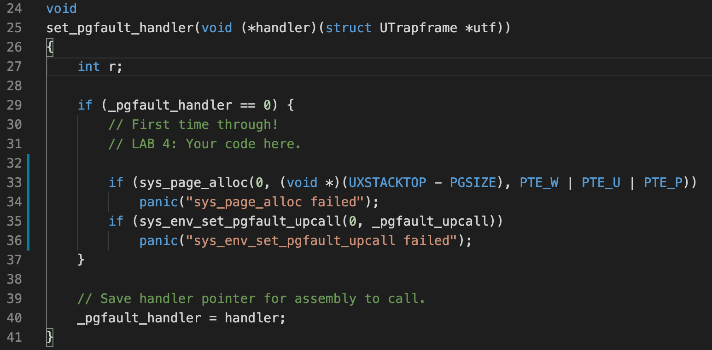
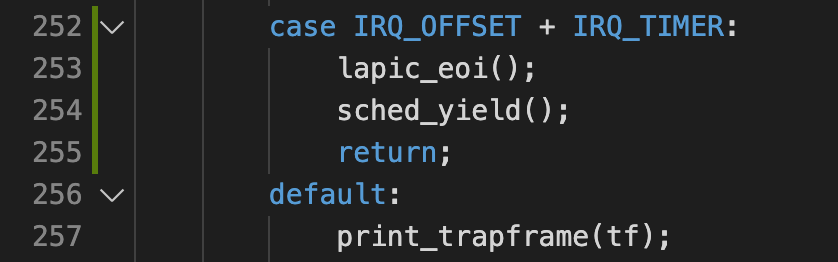
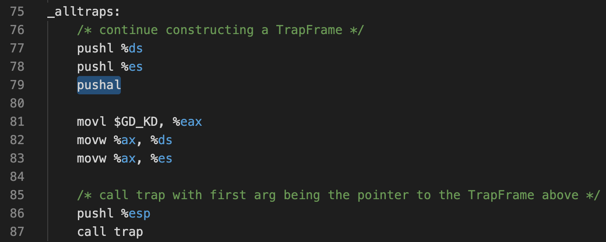

# Lab4: Preemptive multitasking

This lab has 3 sections:

1. Add **multiprocessor support** to JOS, implement round-robin scheduling, and add basic environment management system calls (calls that create and destroy environments, and allocate/map memory).
2. Implement the system calls required for **user-space page fault handling**. Then, implement unix-like `fork()`, which is copy-on-write (COW).
3. Implement **preemptive scheduling** and basic IPC.

Some terminologies used in this lab:

* *Local Advanced Programmable Interrupt Controller* (LAPIC): responsible for delivering interrupts throughout the system.
* *Global Descriptor Table* (GDT): define the characteristics of the various memory areas used during program execution, including the base address, the size, and access privileges like executability and writability.
* *Task State Segment* (TSS): holds information about a task. Each CPU has its own TSS, as defined in GDT.
* *Bootstrap Processor* (BSP): responsible for initializing the system and for booting the operating system. Which processor is the BSP is determined by the hardware and the BIOS.
* *Application Processor* (AP): activated by the BSP only after the operating system is up and running

## Part A: Multiprocessor Support and Cooperative Multitasking

1. Need to startup the APs. We copy the entry code for AP to `0x7000` (`MPENTRY_PADDR`). Modify the physical memory allocator, such that the `MPENTRY_PADDR` page does not get added to the free list. 

    The BSP will send the `STARTUP` interprocessor interrupt (IPI) to the APs to bring up other CPUs (see `lapic_startap()`).

2. Setup per-CPU stacks starting at `KSTACKTOP`. To make each CPUs access the correct stack, update `trap_init_percpu()` to initialize the TSS and TSS descriptor for the BSP:

    

3. Add the big kernel lock by calling `lock_kernel()` and `unlock_kernel()` at the proper locations.

4. Implement round-robin scheduling. At this moment, we can only wait for processes for yield -- we will implement preemtive scheduling in part C.

    Traverse `env[]` to find the next runnable environment:

    
    
5. Implement system calls for environment creation:
  
  ```C
  sys_exofork();            // creates a new environment with an almost blank slate
  sys_env_set_status();     // sets the status of a specified environment to ENV_RUNNABLE or ENV_NOT_RUNNABLE
  sys_page_alloc();         // allocates a page of physical memory and maps it at a given virtual address in a given environment's address space
  sys_page_map();           // copy a page mapping (not the contents of a page!) from one environment's address space to another
  sys_page_unmap();         // unmap a page mapped at a given virtual address in a given environment
  ```
  
  Note that  `fork()` is implemented in user-space, and will call these system calls, which is implemented in Part B.

## Part B: Copy-on-Write Fork

User-space fault handling gives more flexibility. For example, users can implement their own `fork()` and decide whether it copies pages eagarly or lazily.

Execution of the fault handler UDF has to be done a separate **user exception stack**, because:

* User registers the fault handler with a user-space function, so we can't use the kernel stack
* Similar to handling interrupts, the user stack could be corrupted

To setup user-space fault handling:

1. Implement syscall `sys_env_set_pgfault_upcall()`, which sets the handler for the given environment. Each `struct env` has a function pointer to the handler function, initialized to `NULL`.

    *This function is called by `set_pgfault_handler()`, the C user library side of the user-level page fault handling mechanism. It calls ``sys_env_set_pgfault_upcall()`  with the assembly stub `_pgfault_upcall` every time.* 

2. Implement `page_fault_handler()`, an ISR required to dispatch page faults to the user-mode handler.

    * Pushes a `struct UTrapframe` to the user exception stack, containing the context before the fault

    * Call `env_pgfault_upcall()` on the new user exception stack. This is a assembly stub, which we will implement in the next step

        

3. Implement assembly stub `_pgfault_upcall()`, which calls the UDF handler, and then **returns to the original point in the user code that caused the page fault, without going back through the kernel**.

    To this end, we push the trap-time `%eip` to the trap-time stack, restore context and `%esp`, and call `ret`:

    

4. Implement the code in `page_fault_handler` in `kern/trap.c` required to dispatch page faults to the user-mode handler:

    * Calls `sys_env_set_pgfault_upcall()` with the assembly stub `_pgfault_upcall` as argument
    * Set global symbol `_pgfault_handler` to the actual handler, which is called from `_pgfault_upcall`

    

    By calling `_pgfault_upcall` every time (instead of calling the handler UDF directly), we are able to have some control before/after calling the handler UDF, and set up required states.

5. Implement COW `fork()`. Need to setup page table permissions correctly for COW to work.

## Part C: Preemptive Multitasking and Inter-Process Communication (IPC)

Up to now we except processes calling `sys_yield()` to yield. In this part we will implement preemptive scheduling.

External interrupts (i.e., device interrupts) are referred to as **IRQs**. There are 16 possible IRQs, numbered 0 through 15. The mapping from IRQ number to IDT entry is not fixed.`pic_init` in `picirq.c` maps IRQs 0-15 to IDT entries `IRQ_OFFSET` (32) through `IRQ_OFFSET+15` (47).

The clock interrupt is IRQ 0, which is what we use for preemptive scheduling.

* Note that when the scheduler couldn't find a process to schedule, the CPU enters idle by calling `hlt` in  `sched_halt()`. A halted processor returns to active by clock interrupts.

We need to:

1. Unmask interrupts (up to now we have been masking interrupts)

2. Call `sched_yield()` on interrupt:

    

3. Implement basic IPC, which can send 1 integer and 1 page mapping at a time. The IPC involves:

    * 2 system calls:

        ```C
        int sys_ipc_recv(void *dstva);
        int sys_ipc_try_send(envid_t envid, uint32_t value, void *srcva, unsigned perm);
        ```

    * and 2 library wrappers:

        ```C
        int32_t ipc_recv(envid_t *from_env_store, void *pg, int *perm_store);
        void ipc_send(envid_t to_env, uint32_t val, void *pg, int perm);
        ```

## Questions

1. *Compare `kern/mpentry.S` side by side with `boot/boot.S`. What is the purpose of macro `MPBOOTPHYS`?*

    * Addresses in `mpentry.S` are above `KERNBASE`, therefore cannot be addressed in real mode.

2. *It seems that using the big kernel lock guarantees that only one CPU can run the kernel code at a time. Why do we still need separate kernel stacks for each CPU?*

    * The big kernel lock is acquired at the beginning `trap()`. At this point, the handlers have already pushed a `TrapFrame` onto the stack. Therefore multiple processors receiving interrupts simultaneously will corrupt the stack.

3. *In your implementation of `env_run()` you should have called `lcr3()`. Before and after the call to `lcr3()`, your code makes references (at least it should) to the variable `e`, the argument to `env_run`. Why can the pointer `e` be dereferenced both before and after the addressing switch*

    * Every env has the same kernel address mapping.

4. *Whenever the kernel switches from one environment to another, it must ensure the old environment's registers are saved so they can be restored properly later. Why? Where does this happen?*

    * In all interrupt handlers, we call `pushal` to push all registers to form a `TrapFrame`. See `trapentry.S`:

        