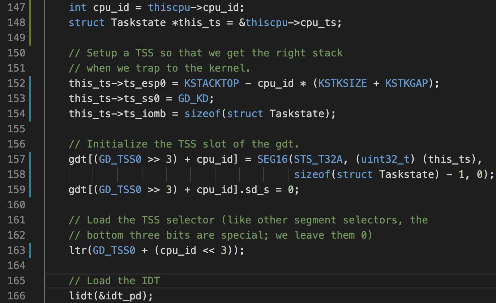
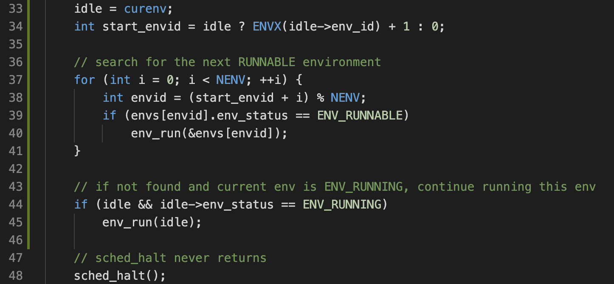
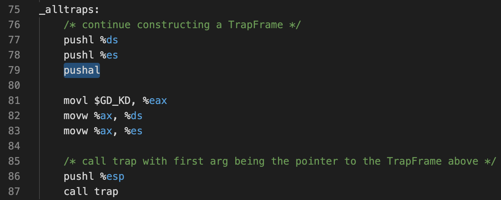

# Lab4: Preemtive multitasking

This lab has 3 sections:

1. Add multiprocessor support to JOS, implement round-robin scheduling, and add basic environment management system calls (calls that create and destroy environments, and allocate/map memory).

Some terminologies used in this lab:

* *Local Advanced Programmable Interrupt Controller* (LAPIC): responsible for delivering interrupts throughout the system.
* *Global Descriptor Table* (GDT): define the characteristics of the various memory areas used during program execution, including the base address, the size, and access privileges like executability and writability.
* *Task State Segment* (TSS): holds information about a task. Each CPU has its own TSS, as defined in GDT.
* *Bootstrap Processor* (BSP): responsible for initializing the system and for booting the operating system. Which processor is the BSP is determined by the hardware and the BIOS.
* *Application Processor* (AP): activated by the BSP only after the operating system is up and running

## Part A: Multiprocessor Support and Cooperative Multitasking

1. We copy the entry code for AP to `0x7000` (`MPENTRY_PADDR`). Modify the physical memory allocator, such that the `MPENTRY_PADDR` page does not get added to the free list. 

    The BSP will send the `STARTUP` interprocessor interrupt (IPI) to the APs to bring up other CPUs (see `lapic_startap()`).

2. Setup per-CPU stacks starting at `KSTACKTOP`. To make each CPUs access the correct stack, update `trap_init_percpu()` to initialize the TSS and TSS descriptor for the BSP:

    

3. Add the big kernel lock by calling `lock_kernel()` and `unlock_kernel()` at the proper locations.

4. Implement round-robin scheduling. At this moment, we can only wait for processes for yield -- we will implement preemtive scheduling in part C.

    Traverse `env[]` to find the next runnable environment:

    
    
5. Implement system calls for environment creation:
  
  ```C
  sys_exofork();            // creates a new environment with an almost blank slate
  sys_env_set_status();     // sets the status of a specified environment to ENV_RUNNABLE or ENV_NOT_RUNNABLE
  sys_page_alloc();         // allocates a page of physical memory and maps it at a given virtual address in a given environment's address space
  sys_page_map();           // copy a page mapping (not the contents of a page!) from one environment's address space to another
  sys_page_unmap();         // unmap a page mapped at a given virtual address in a given environment
  ```
  
  Note that  `fork()` is implemented in user-space, and will call these system calls.

## Questions

1. Compare `kern/mpentry.S` side by side with `boot/boot.S`. What is the purpose of macro `MPBOOTPHYS`?

    * Addresses in `mpentry.S` are above `KERNBASE`, therefore cannot be addressed in real mode.

2. It seems that using the big kernel lock guarantees that only one CPU can run the kernel code at a time. Why do we still need separate kernel stacks for each CPU?

    * The big kernel lock is acquired at the beginning `trap()`. At this point, the handlers have already pushed a `TrapFrame` onto the stack. Therefore multiple processors receiving interrupts simultaneously will corrupt the stack.

3. In your implementation of `env_run()` you should have called `lcr3()`. Before and after the call to `lcr3()`, your code makes references (at least it should) to the variable `e`, the argument to `env_run`. Why can the pointer `e` be dereferenced both before and after the addressing switch

    * Every env has the same kernel address mapping.

4. Whenever the kernel switches from one environment to another, it must ensure the old environment's registers are saved so they can be restored properly later. Why? Where does this happen?

    * In all interrupt handlers, we call `pushal` to push all registers to form a `TrapFrame`. See `trapentry.S`:

        