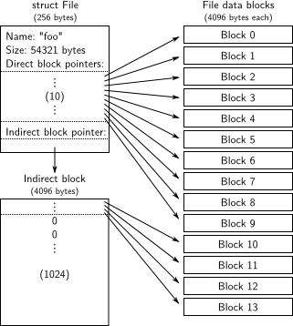
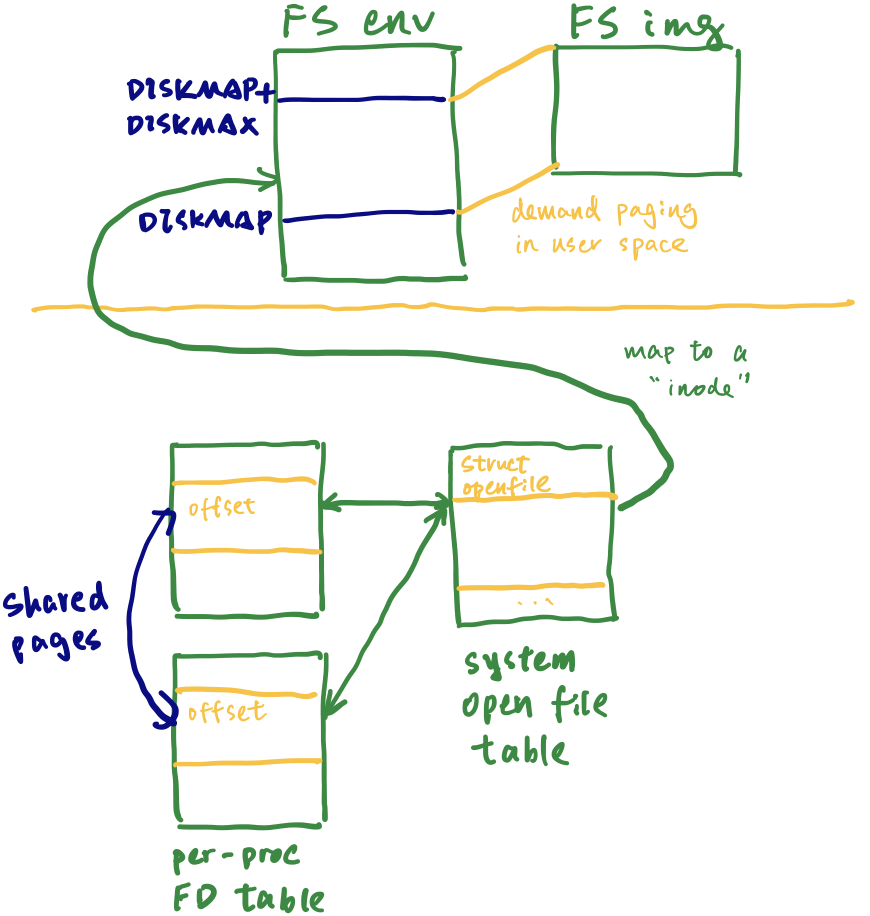
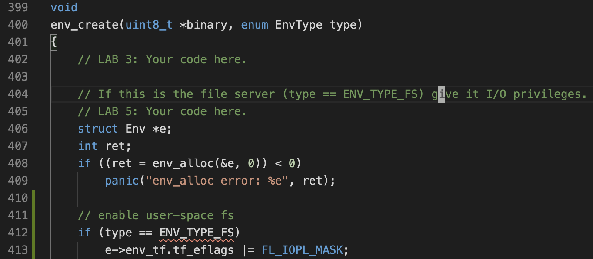
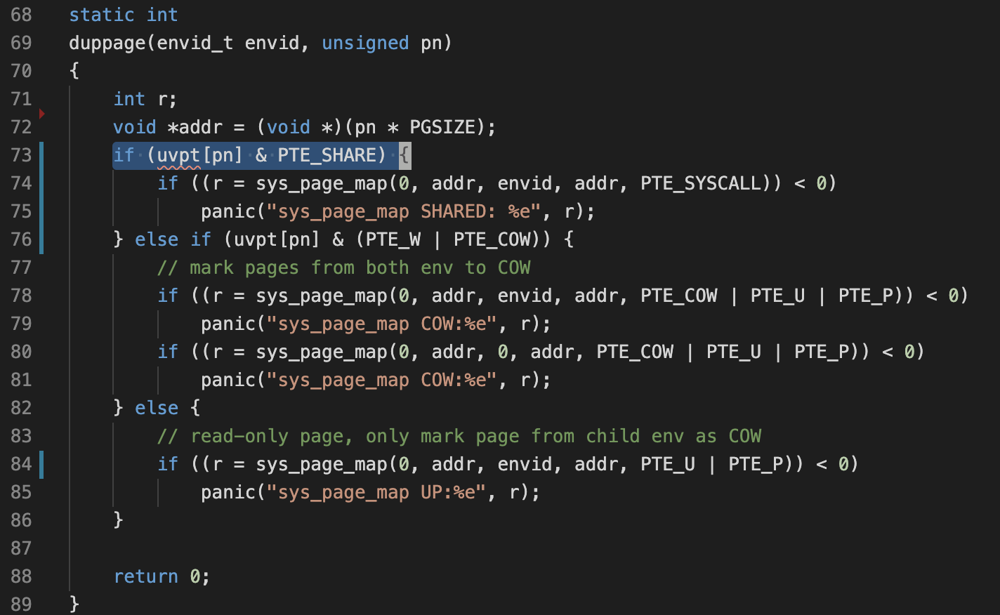

# Lab5: File systems, spawn, and shell

This lab has 2 sections:

1. Set up the file system
2. Spawn a process from the file system

## Part A: The file system

The JOS file system is different from Unix file systems in several ways:

1. Doesn't support hard links. This means we can embed "inodes" directly in the file struct itself. Each "inode" has 10 direct and 1 indirect blocks:

    

2. Offset resides in the per-process FD table, instead of the system-wide open file table. Each FD resides in  its own page. (I'm not sure why it's designed this way)

    This means on `fork()`, the two processes should share the same FD structure, using shared memory. Otherwise, environments won't be able to seek in files they didn't open themselves and that pipes won't work across a `fork()`.

3. This is a **user-space FS**. This is implemented by:

    * Having a FS process with `IOPL` privileges, so it can perform I/O on external devices (`kern/env.c`).

        

    * Communicate with other processes over IPC (`fs/serv.c`).

    * In the FS process, map enture FS space into virtual memory (this is actually a **buffer cache**). Because fault handling is in user-space, we can perform disk read in the fault handler (`fs/bc.c` and `fs/ide.c`).

## Part B: Spawn a process

The `spawn` function effectively acts like a `fork` in UNIX followed by an immediate `exec` in the child process.

We would like to share file descriptor state across `fork` and `spawn`, but file descriptor state is kept in user-space memory. Right now, on `fork`, the memory will be marked copy-on-write, so the state will be duplicated rather than shared.

As mentioned above, we want to share FDs across forks. We will change `fork` to know that certain regions of memory are used by the "library operating system" and should always be shared:

## Other Takeaways

* Sectors & blocks: *sector size* is a property of the disk hardware, whereas *block size* is an aspect of the operating system using the disk.
* Log-structured FS can work, because disk operations are (or are designed to be) idempotent.
* The UNIX file descriptors are a general notion that also encompasses pipes, console I/O, etc. In JOS, each of these device types has a corresponding `struct Dev`, with pointers to the functions that implement `read`/`write` etc. for that device type. `lib/fd.c` implements the general UNIX-like file descriptor interface on top of this. 

## Questions

1. *Do you have to do anything else to ensure that this I/O privilege setting is saved and restored properly when you subsequently switch from one environment to another? Why?*
    * No. The I/O privilege settings is saved in FLAGS, which will be saved in / restored from trap frames every time.
    * Meanwhile, the IOPL can be changed using `POPF(D)` and `IRET(D)` only when the current privilege level is Ring 0, so user programs can't directly change it.

2. *Think about what you would have to do in order to implement `exec` in user space, and be sure you understand why it is harder.*
    * In user-space: program need to load an ELF binary into its own address space on the fly
    * With `spawn()` or in kernel:  `spawn()`/kernel loads the binary into another stationary process, which is much simpler
