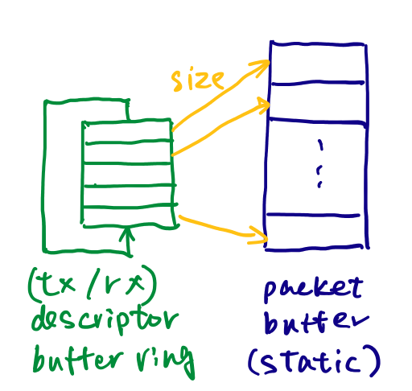
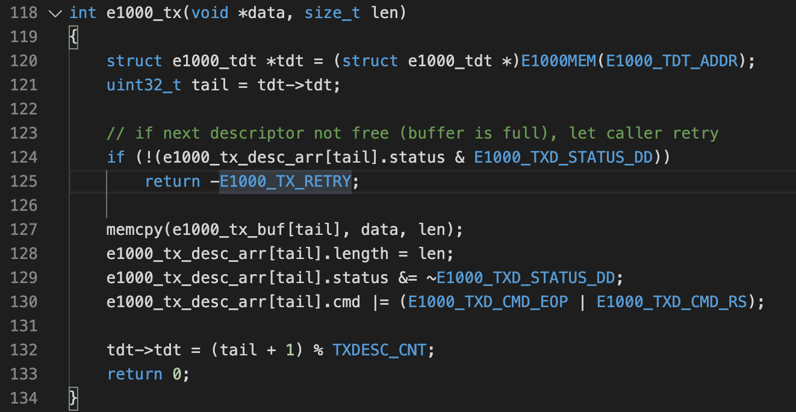
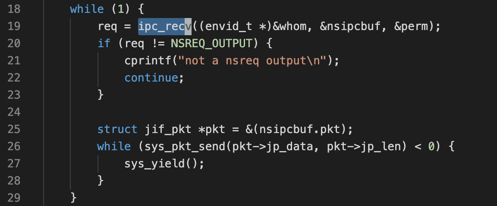
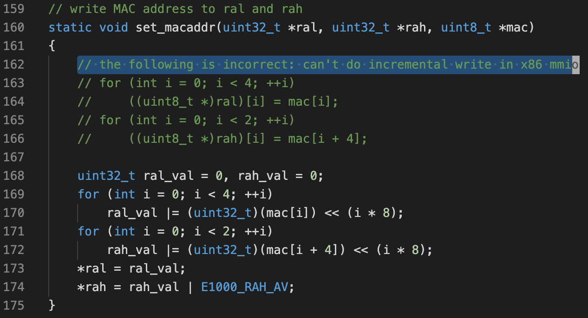

# Lab6: Network Driver

This lab has 2 sections:

1. Initialization and transmitting packets
2. Receiving packets and the web server

This lab uses [*lwIP*](https://savannah.nongnu.org/projects/lwip/), an open source lightweight TCP/IP stack. The network server composes of 4 components:

* core network server environment (includes socket call dispatcher and lwIP)
* input environment
* output environment
* timer environment

You need to implement the parts highlighted in green. The driver will work for the Intel 82540EM NIC (also known as the E1000), based on its [software development manual](8254x_GBe_SDM.pdf).

## Part A: Initialization and transmitting packets

* Follow the steps in manual section 14.5 to setup the NIC (`e1000_tx_init()`).

* Accept tx packets from the output helper environment (`e1000_tx()`). Note that if ring buffer is full, this function returns an error. The output helper environment is reponsible for retry (which will block the `ipc_recv()` and push back on the environment generating the data):

    

* Implement the output helper environment. It receives the `NSREQ_OUTPUT` IPC and passes the packet to the driver:

    

## Part B: Receiving packets and the web server

* Follow the steps in manual section 14.4 to setup the NIC (`e1000_rx_init()`).
* Accept incoming packets, if available, by checking the rx descriptor ring buffer (`e1000_rx()`).
* Implement the input helper environment. If there are incoming packets, send it to the network server over `NSREQ_INPUT` IPC.
* Fill in the missing parts of `user/httpd.c`.

## Other takeaways

* MDI: media-dependent interface

* x86 mmio doesn't necessarily follow memory semantics: [semantics of MMIO mapping attributes across architectures](https://lwn.net/Articles/698014/)

    

## Questions

1. How did you structure your transmit implementation? In particular, what do you do if the transmit ring is full?
    * The driver returns an error to indicate buffer full, and the output environment retries
    * When the output environment retries, it doesn't invoke the next `ipc_recv()`, thus blocking the `ipc_send()` on the network server side
2. How did you structure your receive implementation? In particular, what do you do if the receive queue is empty and a user environment requests the next incoming packet?
    * The driver returns an error to indicate buffer empty, and the input environment calls `sys_yield()` and sleeps for 50ms
3. What does the web page served by JOS's web server say?
    * "This file came from JOS."
4. How long approximately did it take you to do this lab?
    * ???